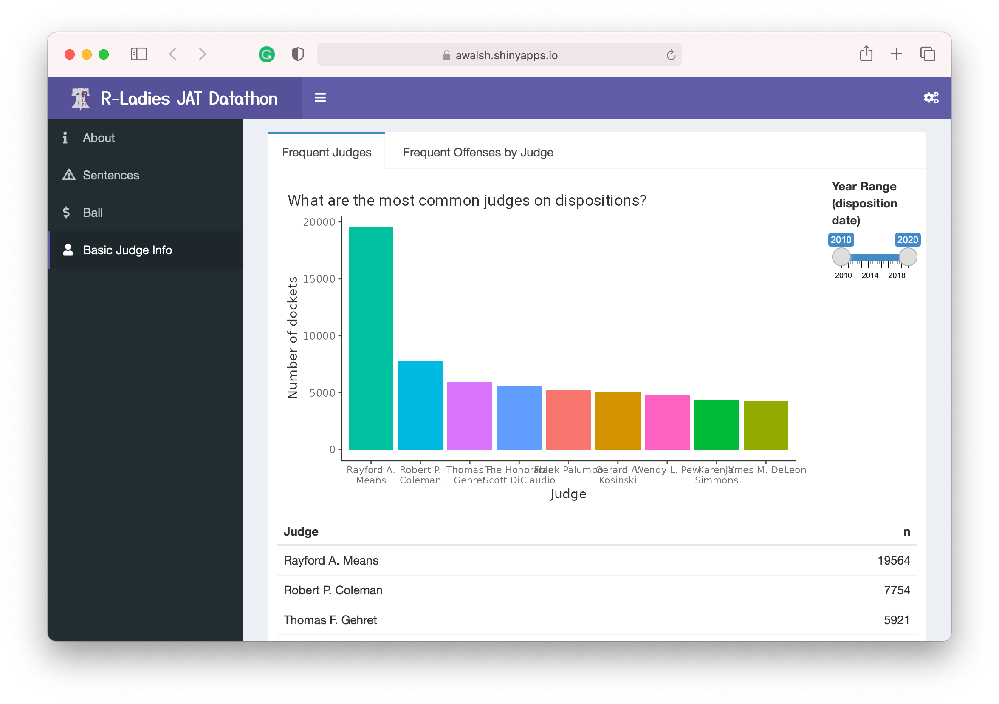
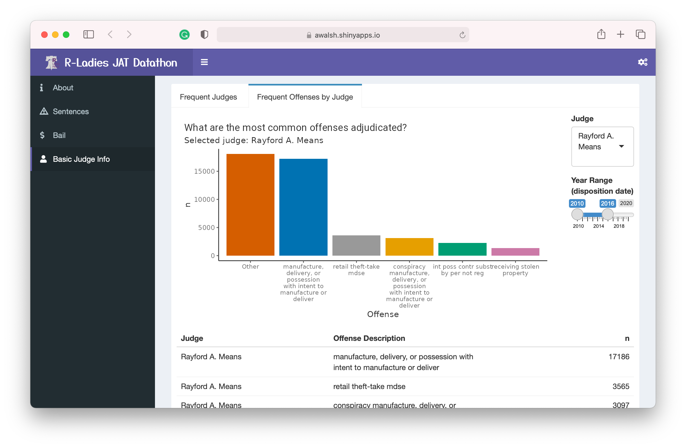

```{r setup, include=FALSE}
knitr::opts_chunk$set(echo = TRUE)
```


# Executive Summary

The docket data from Philadelphia courts is currently inaccessible to the average citizen who wants to learn more about patterns in sentencing and bail in our courts. The data is complex and difficult to work with, even for data professionals. Therefore, we sought to provide a highly interactive web interface to allow the deep interrogation of this data.

# Problem definition and dataset 

**Objective:** Visualize judicial patterns at various levels of abstraction, and if possible, create an interactive dashboard


### Data issues

*The current dashboard provides access to the provided data. However, it is a work-in-progess that could be augmented by additional teams*

**Questions we considered, but were unable to answer**

+ Patterns in leveraging alternatives to prison sentences (e.g., rehabilitation programs)
+ Patterns in probationary period lengths
+ Relationship between bail amount and other variables
+ Relationship between sentencing for cases that did vs did not go to trial
+ Usability of the dashboard for target users; How well do the visualizations align to users’ desired or needed visualizations?

**Major challenges that we did not resolve**

+ Accounting for merged sentences in analyzing sentence lengths
+ Accounting for which seat judges were appointed to
+ Whether to consider each offense and sentence individually or at the docket level
+ Some of the tabs in the dashboard are not as fast and responsive as we would have liked


# Methods and Results 

<span style="color:gray">*Could we add methods for each team members section here??.*</span>

The outcomes of our team's efforts were the following:

- An interactive dashboard to explore the data and enable someone to dive into specific questions. 
- Visualizations focused on
  - Sentencing patterns by judge and by race
  - Bail increases and decreases by judge
  - Bail patterns by season and other factors

The dashboard is currently hosted at a temporary location: [https://awalsh.shinyapps.io/2021_datathon_dashboard/](https://awalsh.shinyapps.io/2021_datathon_dashboard/)

## Dashboard construction
[GitHub code repository](https://github.com/yjunechoe/2021_datathon_dashboard)

### Sentences
We created three different sections to visualize sentence length. These are represented by three tabs in the "Sentences" section of the dashboard.

### Bail

### Basic Judge Info
We added a third section to the dashboard, which is useful for new users who may not have any familiarity with individual judges or the types of cases adjudicated in Philadelphia courts.

The "Frequent Judges" tab allows one to identify the judges that appear on the most number of dockets for a selected time period. The data is displayed in a column chart as well as a table.



The "Frequent Offenses by Judge" tab allows one to select a judge and a date range and then see the 5 most frequent offense descriptions for those inputs. All the remaining offenses are grouped into a 6th category called "Other". The data is displayed in a column chart as well as a table.


The input data for both the above sections was modified from the source data. First, the data was filtered to only offenses with a disposition. In other words, if the disposition (e.g., ) was missing for a given offense on a given docket, it was removed. Second, the values for the offense descriptions (e.g., "retail theft-take mdse") were cleaned to remove redundancy. The "statute_description" variable in the provided data was modified to be all lower case to remove duplicates caused by differences in cases (i.e., "Theft" is the same as "theft"). Then differences in spacing were adjusted to remove duplicates (i.e., two spaces is the same as one space). Conspiracy offenses (statute 18 Pa CS 903) needed to be considered specially. Conspiracies all have the same statute code, but they also have an "object offense", that tells you that the defendant was conspiring to do. The grades should reflect these differences as well. Therefore, we wanted to keep the full statute description for these offenses. 


# Conclusions and Next Steps 

We created a dashboard that has broad functionality and serves as a proof-of-concept for how judge data could be made more broadly accessible. However, this dashboard is a work-in-progress and could benefit from additional work.

The next steps would be the following:

- Receive feedback on any major changes that should be made to the dashboard before launching
- Identify a permanent web address to host the dashboard. This could be using the R-Ladies Philly account or a new domain could be purchased and the dashboard could live there. However, this would require annual monetary investment to maintain
- Solicit any new visualizations that could be added based on the work of teams 2 and 3. In particular, our team did not perform any rigorous modeling such as that performed by teams 2 and 3. That information would be valuable to help guide a user to understand better the patterns observed.

Our team also identified some longer-term objectives that could be incorporated in a future version of this project, should anyone want to take them on:

- Develop a detailed user guide for the dashboard to make it easier for a new user to successfully navigate the page
- Incorporate timely information from social media using judge's accounts or accounts that are commenting on judges
- Incorporate additional data, such as census information (income levels)
- Implement algorithms that follow the Pennsylvania sentencing guidelines and then compare each disposition to how well it follows (or does not) these guidelines
- Incorporate neighboring jurisdictions data
- Incorporate third-party research reports on related topics for additional reading and context


# Team Contributors & Acknowledgements

<span style="color:gray">*This section should list the names and 1-2 sentence descriptions of everyone who worked on the submission. An example is listed below (please replace the example with your own info).*</span>

**Gritty McGritty, MSc** is a data scientist with Philly's DataForGood nonprofit, and a student of applied statistics at DataIsLife University. In both roles, Gritty enjoys conducting predictive analyses and natural language processing.

**Alice Walsh, PhD** is a computational biologist at Bristol Myers Squibb and an organizer of R-Ladies Philly. She enjoys data cleaning, generating hypotheses from complex data, and mentoring others.

We would like to thank the other team's for their valuable help in understanding and cleaning the data. We would like to thank the R-Ladies organizers for... The JAT team for providing the data and the extremely valuable guidance throughout the project. Other....
