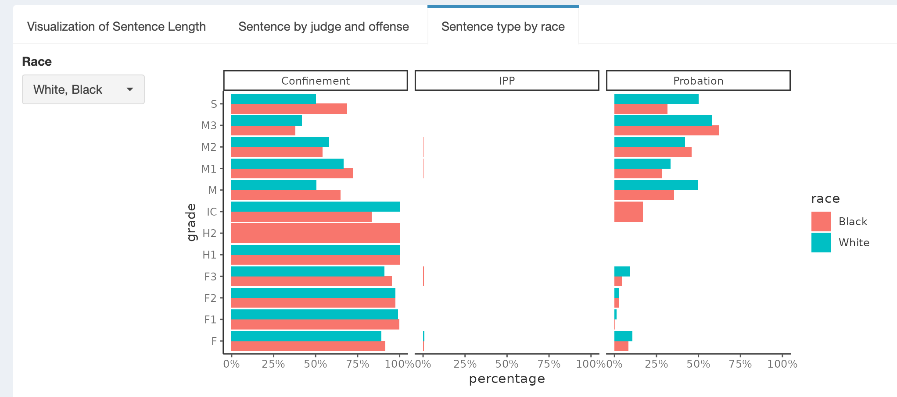
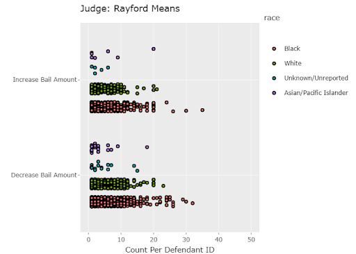
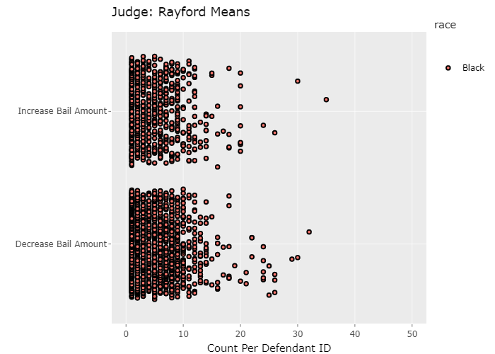

```{r setup, include=FALSE}
knitr::opts_chunk$set(echo = TRUE)
```


# Executive Summary

The docket data from Philadelphia courts are currently inaccessible to the average citizen who wants to learn more about patterns in sentencing and bail decisions in our courts. The data is complex and difficult to work with, even for data professionals. Therefore, we sought to provide a highly interactive web interface to allow the deep interrogation of this data.

# Problem definition and dataset 

**Objective:** Visualize judicial patterns at various levels of abstraction, and if possible, create an interactive dashboard


### Data issues

*The current dashboard provides access to the provided data. However, it is a work-in-progress that could be augmented by additional teams*

**Questions we considered, but were unable to answer**

+ Patterns in leveraging alternatives to prison sentences (e.g., rehabilitation programs)
+ Patterns in probationary period lengths
+ Relationship between bail amount and other variables
+ Relationship between sentencing for cases that did vs did not go to trial
+ Usability of the dashboard for target users; How well do the visualizations align to users’ desired or needed visualizations?

**Major challenges that we did not resolve**

+ Accounting for merged sentences in analyzing sentence lengths
+ Accounting for which seat judges were appointed to
+ Whether to consider each offense and sentence individually or at the docket level
+ Some of the tabs in the dashboard are not as fast and responsive as we would have liked


# Methods and Results 

<span style="color:gray">*Could we add methods for each team members section here??.*</span>

The outcomes of our team's efforts were the following:

- An interactive dashboard to explore the data and enable someone to dive into specific questions. 
- Visualizations focused on
  - Sentencing patterns by judge and by race
  - Bail increases and decreases by judge
  - Bail patterns by season and other factors

The dashboard is currently hosted at a temporary location: [https://awalsh.shinyapps.io/2021_datathon_dashboard/](https://awalsh.shinyapps.io/2021_datathon_dashboard/)

## Dashboard construction

The visualization dashboard was built with `{shiny}` and `{shinydashboard}`, with additional theming from {shinydashboardPlus}, {shinywidgets}, and others. The dashboard was partitioned first by the dataset which could be selected in the left-hand-side sidebar panel, and secondly by visualization of a particular relationship/question of interest in the tab panels. 

Standardization of plots was achieved via the `{thematic}` package, which allowed a common theme to be set for all ggplots. In addition to shiny-driven reactivity, we also used the `{ggiraph}` package for surface-level interactivity such as highlighting and showing tooltips on hover. Some visualizations were accompanied by the full underlying data presented in a table, which filtered interactively using the `{reactable}` package with additional styling from the `{reactablefmtr}` package.

Data for the dashboard was pre-processed to a reasonable size, so all data was able to be hosted alongside the dashboard code on Github. To minimize data wrangling processes inside the dashboard instance, we strived for modularity such that the original data was split and each resulting dataset was used for a coherent set of research questions. This design also worked very nicely in incorporating individual contributions to the final dashboard.

The source code for the dashboard can be found on [GitHub](https://github.com/yjunechoe/2021_datathon_dashboard).

### Sentences

We created three different sections to visualize sentence length. These are represented by three tabs in the "Sentences" section of the dashboard.

*Visualization of Sentence Length*

This dataset included demographic information and various details about the committed crimes that might be of interest when comparing judges and the length of sentences. This section of the dashboard allows the user to determine which metadata is important to them and select which judges they would like to compare. Multiple user inputs allow the user to filter the dockets based on race, disposition method, grade of the offense, and to select for specific dockets based on an input keyword such as “Theft”, “Child”, “Auto”, or any other keyword of the user’s choice. The user also has the option of changing how the data is grouped, easing the comparison between judges based on whatever metadata might interest the user. 

Keep in mind that this panel is done at the docket level, meaning that the sentence length on the y axis reflects the maximum sentence time for that docket and that the crime descriptions may have been combined to account for all offenses committed on the same docket. 


*Sentence by Judge and Offense*

One question someone might be interested in is whether a single judge follows similar patterns as the “average” judge for a given type of offense. This section of the dashboard allows a user to explore this type of question with 3 user inputs. The output is two graphs and a table.

The user can select an offense from a pulldown menu with descriptions of the statutes (e.g., “simple assault”). Then the user can filter to only certain grades (all are selected by default) and select the judge of interest. Finally, the user can select to view a simplified plot where all the grades are considered together or you can stratify by the grade by checking the “Separate by Grade” option.

The first plot gives an overview of the sentence type (Probation, no further penalty, confinement, etc.). The second plot summarizes the sentence lengths (both confinement and probation). In both cases, the selected judge is plotted side by side with the information from all other judges aggregated together.

Keep in mind that the data used here is only for offenses that had an associated sentence/disposition. In other words, this analysis is at the “offense-level” and not the “docket-level”. This visualization does not consider other factors about the docket such as other offenses on the docket, the defendant’s record, or the disposition method. Finally, this approach will exclude occurrences of offenses where that specific offense was not associated with any sentence (but others on the docket were).

The input data for both this section was modified from the source data. First, the data was filtered to only offenses with a disposition. In other words, if the disposition (e.g., “Guilty”) was missing for a given offense on a given docket, it was removed. Second, the values for the offense descriptions (e.g., "retail theft-take mdse") were cleaned to remove redundancy. The "statute_description" variable in the provided data was modified to be all lower case to remove duplicates caused by differences in cases (i.e., "Theft" is the same as "theft"). Then differences in spacing were adjusted to remove duplicates (i.e., two spaces is the same as one space). Conspiracy offenses (statute 18 Pa CS 903) needed special consideration. Conspiracies all have the same statute code, but they also have an "object offense", that tells you that the defendant was conspiring to do. The grades should reflect these differences as well. Therefore, we wanted to keep the full statute description for these offenses. 
 
*Sentence Type by Race* 

The third tab under the Sentences section examines how for similar offense grade, there was a difference in the sentencing based on the defendant's race. The percentages shown are the percentage of sentences for a given grade and race. The user can select the races to compare and then visualize the differences. For example, the below image shows that more serious crimes (felony grade, “F”) are more often sentenced with confinement and no probation as we expect. When comparing black defendants to white defendants, we observe a pattern for misdemeanor crimes (grades of “M”). Black defendants are more often sentenced to confinement than probation than white defendants for some grades.



### Bail

*Net Bail Amount Actions*

The “Net Bail Amount Actions” tabs allow a user to view the number of times a judge increased or decreased bail overall.

The first interactive plot shows the cumulative total of bail increases and decreases by a given judge. Increases equal 1 while decreases equal -1. Judges that increase bail amounts more often than they decrease them have a positive value, while the opposite is true for judges that decrease bail amounts more often. The bar fill indicates the total number of bail changes (both increases and decreases). The table below the plot gives the total number of actions and the cumulative total.

The second tab and plot visualizes the same data, but allows the user to select and compare specific judges by name.

We observed that most judges overwhelmingly decreased bail with the judges with the highest number of total actions also tending to decrease bail the most number of times.


*Bail Amount and Type*

Many jails in the country have set bail schedules that will specify bail amounts for the most commonly committed crimes. Judges can lower or increase these bail amounts for offenders as well as set bail. In this analysis, we explored and analyzed judges’ behavior with bail over the last 20 years. 

The “Bail” dataset was merged with datasets “Offenses and Dispositions” (variables selected from this dataset: description, defendant id & docket id) and “Defendant and Docket” (variables selected from this data set: gender, race, & docket id) by the “docket id” variable. The data was cleaned and manipulated for analysis.

Under the “Bail” tab of the dashboard, there is a category called “Bail Amount and Type” which contains three other bail categories to explore. The first category “Mean Bail Amount” shows a horizontal bar graph of the mean bail amount grouped by race and action type. Here you can select your judge of choice and depending on the year when data collection began for each judge you can select the years (in increments of 2 years) to explore the mean bail amounts over the last 20 years.

In the next tab called “Bail Actions,” we explore bail action types a bit further by looking at the number of times a judge had to perform an action type by race. Additionally, we were able to further explore individual action types by race and gender but this is not a feature enabled on the dashboard yet but can be in the future. Below is an example image (Image 1.) that explores counts for bail increases and decreases by race for judge Rayford Means and the second image (Image 2.) dives deeper and looks at counts for bail increases and decreases among black defendants only. In the future this analysis can be further explored by looking at the defendant description for each time bail was increased or decreased per defendant. This would be a very helpful visualization for analyzing biases for the different offenses and defendants. 





The last category under “Bail Amount and Type” is “Bail by Season” which displays action type categories for a selected judge by season. These seasonal categories were created by categorizing months into their respective yearly seasons. This is helpful for visualizing any trends for action types throughout the year. This is particularly interesting to observe if holiday-filled seasons or warmer weather affect bail increases and decreases per judge. 

### Basic Judge Info

We added a third section to the dashboard, which is useful for new users who may not have any familiarity with individual judges or the types of cases adjudicated in Philadelphia courts.

The "Frequent Judges" tab allows one to identify the judges that appear on the most number of dockets for a selected time period. The data is displayed in a column chart as well as a table.


The "Frequent Offenses by Judge" tab allows one to select a judge and a date range and then see the 5 most frequent offense descriptions for those inputs. All the remaining offenses are grouped into a 6th category called "Other". The data is displayed in a column chart as well as a table.


The input data for both the above sections were modified from the source data. See the section above (Sentences by Judge and Offense) for full details. 


# Conclusions and Next Steps 

We created a dashboard that has broad functionality and serves as a proof-of-concept for how judge data could be made more broadly accessible. However, this dashboard is a work-in-progress and could benefit from additional work.

The next steps would be the following:

- Receive feedback on any major changes that should be made to the dashboard before launching
- Identify a permanent web address to host the dashboard. This could be using the R-Ladies Philly account or a new domain could be purchased and the dashboard could live there. However, this would require annual monetary investment to maintain
- Solicit any new visualizations that could be added based on the work of teams 2 and 3. In particular, our team did not perform any rigorous modeling such as that performed by teams 2 and 3. That information would be valuable to help guide a user to understand better the patterns observed.

Our team also identified some longer-term objectives that could be incorporated in a future version of this project, should anyone want to take them on:

- Develop a detailed user guide for the dashboard to make it easier for a new user to successfully navigate the page
- Incorporate timely information from social media using judge's accounts or accounts that are commenting on judges
- Incorporate additional data, such as census information (income levels)
- Implement algorithms that follow the Pennsylvania sentencing guidelines and then compare each disposition to how well it follows (or does not) these guidelines
- Incorporate neighboring jurisdictions data
- Incorporate third-party research reports on related topics for additional reading and context


# Team Contributors & Acknowledgements

**June Choe** is a PhD student in Linguistics at the University of Pennsylvania. He studies the mechanisms of human language acquisition and processing, and enjoys practicing data visualization with R in his free time.

**Alison Moss** is a PhD student at Thomas Jefferson University studying systems biology and neural control of the autonomic circuit governing hypertension development. She enjoys writing R code and R packages to aid in data visualization. 

**Sybil Andrieux, MS** is a REDCap Administrator at Children’s Hospital of Philadelphia. She enjoys learning and using R. 

**Alice Walsh, Ph.D.** is a computational biologist at Bristol Myers Squibb and an organizer of R-Ladies Philly. She enjoys data cleaning, generating hypotheses from complex data, and mentoring others.

**Kulbir Kaur**

**Roy Aizen**

We would like to thank the other teams for their valuable help in understanding and cleaning the data. We would like to thank the R-Ladies organizers for creating this event and the infrastructure to complete the analysis. Finally, our sincer thanks to the JAT team for providing the data and the extremely valuable guidance throughout the project. 
