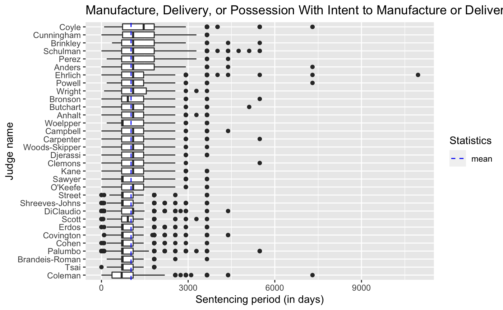
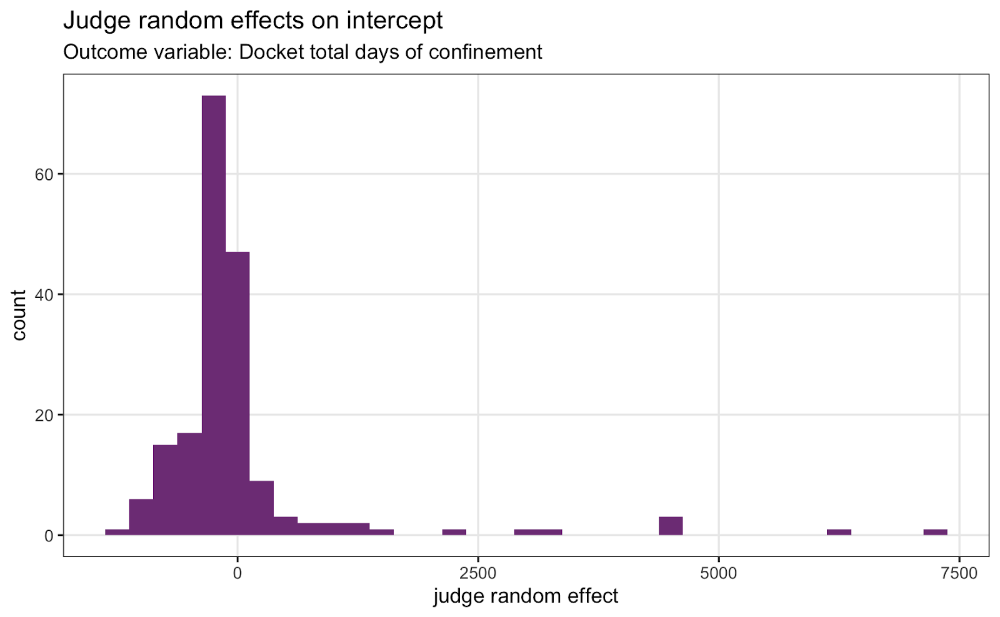

```{r setup, include=FALSE}
knitr::opts_chunk$set(echo = FALSE, 
                      warning = FALSE, 
                      message=FALSE)
```

## Executive Summary

* We examined whether some judges are harsher than others. Days of confinement were the metrics of judge harshness. Because judges are presented with different cases, linear regression was used to achieve fairer comparison among judges. 

* Results suggest that there appear to be differences in harshness among judges. 

* The models allow prediction of the average days of confinement by a judge, inferring whether one judge is harsher than another.  

* Estimates from the model were used to categorize judge harshness into low, medium, and high.

* These results are preliminary as diagnostics of the regression models indicate that the models need to be further improved. 

## Contributors 

Russ Lavery, Shenee, Vera, Jessie Pluto, May Sophia, Alex Lesicko
Adam Schlesinger, Jayeon Kim, Eamon Caddigan, Spandana Makeneni, Shanti Agung


## Problem definition and dataset

Our team focused on the problem of judge harshness. We first attempted to quantify judge harshness. Among the challenges in quantifying judge harshness is that judges are presented with different cases. For example, some judges might work on cases laden with severe offenses, while others might be presented with cases of light offenses. We then sought to answer whether some judges are harsher than others.

We approached the problem in two ways: approach 1 and approach 2. Approach 1 is a visualization of sentencing patterns. Approach 2 is statistical modeling. 

Team 2 created two detailed reports that are available online. This report is a higher-level summarization of the results. For detailed reports, please follow these links:  

+ Approach 1 is detailed in [*kim_eda.Rmd*](https://github.com/rladiesPHL/2021_datathon/blob/main/analyses/team2/kim_eda.Rmd) 
+ Approach 2 is detailed in [*team2_report_modeling_approach.pdf*](https://github.com/rladiesPHL/2021_datathon/tree/main/analyses/team2/report)

Of the datasets that JAT provided, we used *defendant_docket_details.csv*, *offenses_dispositions_v3.csv*, and *defendant_docket_id.csv*. We used dockets filed in year 2010 to 2019. Our consideration for this time span was that year 2020 was such an unusual year, thus likely unusual behavior too, due to the pandemic. Further, we used cases that are completed. That is, the docket’s status is: “Closed” or “Adjudicated”. We excluded ongoing cases -- that is, docket status is “Active” or “Inactive” -- because sentencing information in these cases may not reflect the entire sentences once these cases are completed. The final dataset that we used to fit the model consists of 176,712 dockets and 186 judges.

Approach 1 used the *offenses_dispositions* data and limited the data to sentencing by judges who are currently serving in Philadelphia County. The list of active judges was pulled from Ballotpedia (https://ballotpedia.org/Philadelphia_County,_Pennsylvania_(Judicial)).

\pagebreak

## Results

Please refer to the full reports linked above. These reports have extensive details on the modeling approach and visualizations of the results. Here are just two examples pulled from the team 2 results.

### Which Judges Ordered Longer Sentences?

All boxplots showed Judge Coyle ordered longer than average sentences (Figure 1).
Other judges like Judge Cunningham and Judge Bronson (especially for felonies) also tended to order longer than average sentences.



### Random Coefficient Models

The random effects on intercept for each judge were estimated. Higher values indicate longer confinement sentences (which could indicate "harsher" judges). In the histogram below, we observe that some judges to appear to be "harsher" than others (Figure 2).


\pagebreak

## Conclusions and Next Steps

Conclusions:

* Using days of confinement as measures of judge harshness, results suggest that there appear to be differences in harshness among judges. 

* The random effects on intercepts and judge fixed effects allow prediction of the average days of confinement by a judge, thus inferring whether one judge is harsher than another.  

* The random and fixed effects were used to categorize judge harshness into low, medium, and high.

* These results are preliminary as diagnostics of the regression models indicate that the models need to be further improved.


Several next steps that should be taken include:

* Examine issues noted in the *Data issues* section: repeated content of `description` and `statute_description`; issues with `sequence_number`, extreme values on the number of grade severity in a docket; issues with the birth date of some defendants; and issues with pairing of `defendant_id` and `docket_id`.

* Include additional terms in the model (e.g., interactions and/ or polynomial).

* Solve the outliers issues as pointed out by the diagnostics of the fitted models. 

* Consider including additional explanatory variables, such as the location of the trials, attorney (e.g., public attorney, private attorney), and judge-related information.

* Implement generalized linear mixed models.

