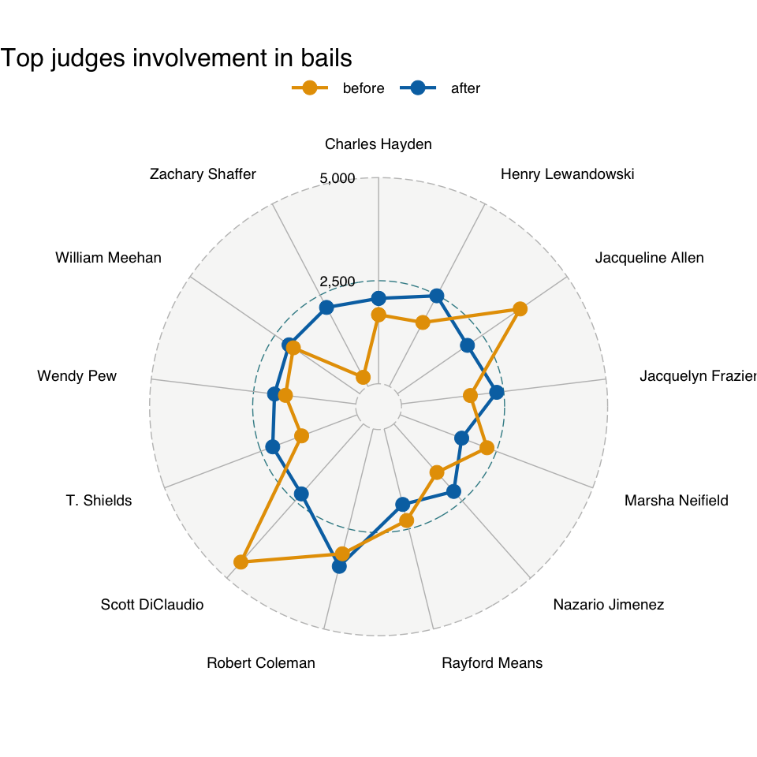
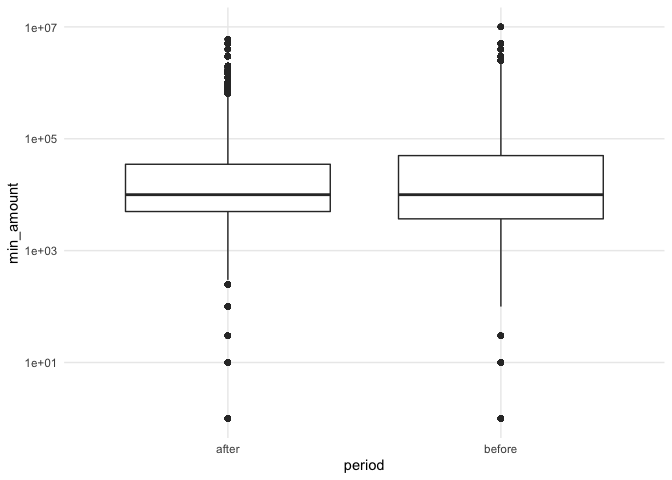

Explore bails
================

# Team 3: Understanding Systemic Trends

Examine how things have changed in the courts since Larry Krasner took
office in January 2018. Some example trends of interest:

-   Number of people charged overall and by type of charge
-   Harshness in bail and/or sentencing
-   Number of defendants who fail to pay low monetary bail
-   Trends in case dismissals, probation, parole, etc.

``` r
library(tidyverse)
library(skimr)
library(lubridate)
library(ggradar)

color_blind_pal <- c("#0072B2", "#E69F00", "#56B4E9", "#009E73", "#F0E442", "#CC79A7")

theme_set(theme_minimal())
theme_update(panel.grid.minor = element_blank())
```

Uncomment the following chunk to filter to the periods before and after
Larry Krasner took office.

``` r
# bail_short <- vroom::vroom('csv/bail.csv')
# # skim(bail_short)
# # str(bail_short)
# # table(bail_short$action_type_name)
# 
# larry_date <- as.Date('2018-01-31')
# start_period_1 <- larry_date - period(2, 'years')
# end_period_2 <- larry_date + period(2, 'years')
# 
# bail_larry <- bail_short %>%
#   mutate(period = case_when(
#     action_date < larry_date & action_date >= start_period_1 ~ 'before',
#     action_date >= larry_date & action_date < end_period_2 ~ 'after',
#     TRUE ~ NA_character_)) %>%
#   filter(!is.na(period))
# 
# save(bail_larry, file = 'processed-data/bail-larry.rds')
```

``` r
load('processed-data/bail-larry.rds')
```

Changes in judges involvement:

``` r
bail_judges <- bail_larry %>%
  mutate(judge_name = case_when(
    is.na(participant_name__first_name) ~ NA_character_,
    TRUE ~  paste(participant_name__first_name,
                            participant_name__last_name)))

judges <- bail_judges %>%
  count(period, docket_id, judge_name) %>% 
  drop_na(judge_name) %>% 
  group_by(docket_id) %>% 
  mutate(weighted_n = n/sum(n)) %>% 
  ungroup() %>% 
  group_by(period, judge_name) %>% 
  summarise(total_adj_n = sum(weighted_n)) 
```

    ## `summarise()` has grouped output by 'period'. You can override using the `.groups` argument.

``` r
judges %>% 
  mutate(rank = dense_rank(desc(total_adj_n))) %>% 
  group_by(judge_name) %>% 
  filter(min(rank) <= 10) %>%
  select(- rank) %>% 
  pivot_wider(names_from = judge_name, 
              values_from = total_adj_n, 
              values_fill = 0) %>% 
  ggradar(values.radar = c(NA, '2,500', '5,000'),
          group.colours = color_blind_pal,
          grid.mid = 2500,
          grid.max = 5000,
          base.size = 1,
          legend.position = "top") + 
  labs(title = 'Top judges involvement in bails') +
  guides(color = guide_legend(reverse = TRUE))
```

    ## Warning: Removed 1 rows containing missing values (geom_text).

<!-- -->

``` r
min_bail <- bail_larry %>% 
  group_by(docket_id) %>% 
  mutate(min_amount = min(total_amount)) %>% 
  ungroup()

min_bail %>% 
  ggplot(aes(x = period, y = min_amount)) +
  geom_boxplot() +
  scale_y_log10()
```

    ## Warning: Transformation introduced infinite values in continuous y-axis

    ## Warning: Removed 738810 rows containing non-finite values (stat_boxplot).

<!-- -->

``` r
knitr::knit_exit()
```
